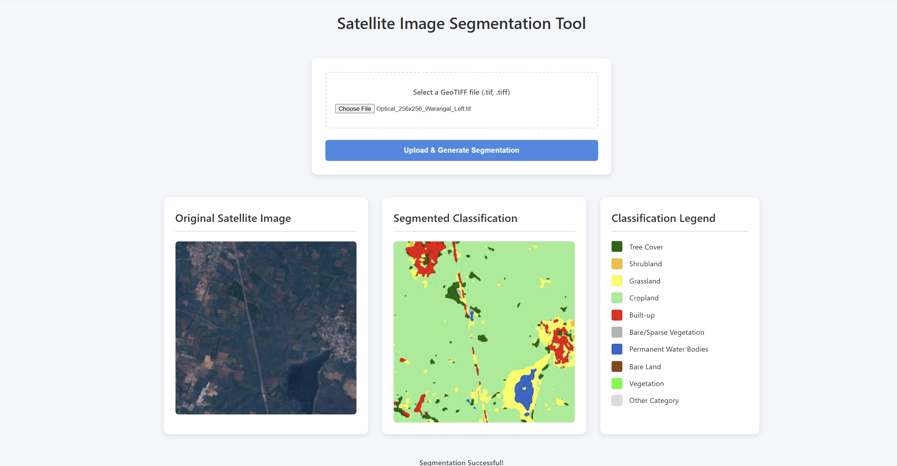

# Satellite-segmentation
U-Net-based semantic segmentation of Sentinel-2 satellite images for LULC classification – ISRO internship project
## 📌 Key Highlights
- Achieved 91% classification accuracy
- Built using TensorFlow, GEE, and ESA WorldCover data
- Applied for Hyderabad region LULC and change detection
- Streamlined preprocessing with GEE, reducing time by 30%

## 🛠️ Tech Stack
- Python, TensorFlow
- Google Earth Engine
- U-Net architecture
- Satellite image segmentation

### 🛰️ Sample Output (Hyderabad AOI - Land Cover Segmentation)

